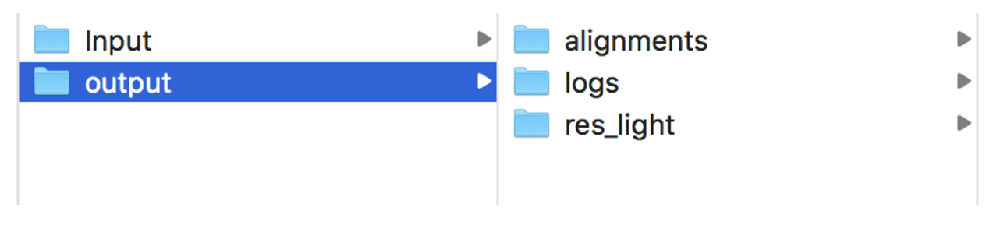

========
Cookbook
========

.. _normal_mode_example:

BamQuery always expects to find in the input folder `path_to_input_folder` the files : **BAM_directories.tsv** and **peptides.tsv**. 

normal mode example
===================

Although BamQuery has the --mode option, you can run the command line without specifying normal mode, as this is the default mode for running BamQuery.

**Command line:**

.. code::

	BamQuery.py ./normal_mode_example/Input normal_mode_example

**1. Input**
------------

Download BAM_directories.tsv and peptides.tsv for an example of the format of these files.

See:
:download:`BAM_directories.tsv <_static/BAM_directories.tsv>`

See:
:download:`peptides.tsv <_static/peptides.tsv>`

**2. Output**
-------------

BamQuery will create a new directory called **output** in the same directory as the input folder.

This directory will contain 4 folders and the main outputs are organized as follows:

.. code::

	├── alignments
	│   ├── missed_peptides.info
	│   └── normal_mode_info_alignments.xlsx
	├── logs
	│   ├── BamQuery_Res_normal_mode.log
	│   └── Information_BAM_directories.log
	├── plots
	│   ├── biotypes
	│   │   ├── biotype_by_sample_group
	│   │   │   ├── all_peptides
	│   │   │   │   └── normal_mode_All_peptides.pdf
	│   │   │   └── by_peptide_type
	│   │   │       └── normal_mode_Ovarian_All_samples.pdf
	│   │   └── genome_and_ERE_annotation
	│   │       ├── all_peptides
	│   │       │   └── normal_mode_All_peptides.pdf
	│   │       └── by_peptide_type
	│   │           └── normal_mode_Ovarian.pdf
	│   └── heat_maps
	│       └── transcription_evidence_heatmap
	│           ├── average_transcription_expression_heatmap
	│           │   └── norm_info.csv
	│           └── total_transcription_expression_heatmap
	└── res
	    ├── biotype_classification
	    │   ├── full_info_biotypes
	    │   │   ├── 1_Genomic_and_ERE_Annotations_Full.csv
	    │   │   ├── 2_Genomic_and_ERE_Annotations_Summary_Full.csv
	    │   │   └── 3_Genomic_and_ERE_Anno_by_Region_Full.csv
	    │   └── summary_info_biotypes
	    │       ├── 1_General_Gen_and_ERE_Biotype_Consensus.csv
	    │       ├── 2_Sample_Gen_and_ERE_Biotype_Consensus.csv
	    │       ├── 3_Group_Samples_Gen_and_ERE_Biotype_Consensus.csv
	    │       ├── biotypes_by_peptide_alignment_and_sample_explained_RNA.csv
	    │       ├── biotypes_by_peptide_genome_explained.csv
	    │       └── biotypes_by_peptide_sample_explained_RNA.csv
	    ├── info_bam_files_tissues.csv
	    └── normal_mode_count_norm_info.xlsx

---------------

.. _output_normal_mode_example:

**2.1. Alignments**
-------------------

.. code::

	├── alignments
	   ├── missed_peptides.info
	   └── normal_mode_info_alignments.xlsx

**missed_peptides.info file**

This file will tell you the peptides for which BamQuery could not find locations in the genome. Therefore, quantification of the expression of these peptides is lacking.

.. _normal mode example info alignments explanation xlsx file:

**normal_mode_example_info_alignments.xlsx file**

This file reports, for each peptide queried, all locations in the genome that are perfect alignments for one or more MAP coding sequences. For each MAP: the position, the strand, the MCS, reference amino acid, nucleotide differences and the SNVs annotated in the dbSNP database are reported. In the case of the latter, it will be reported that the coding sequence has some difference with the reference genome, but that it has been compensated by one or more annotated SNVs.

.. thumbnail:: _images/normal_mode_example_info_alignments.png

.. _Logs:

**2.2. Logs**
-------------

.. code::

	├── logs
	│   ├── BamQuery_Res_normal_mode.log
	│   └── Information_BAM_directories.log
	      		       

**BamQuery_Res_normal_mode_example.log file**

This file reports all the steps that have been performed in the BamQuery search. Please refer to this file for troubleshooting.

**Get_Read_Count_BAM_directories.log file**

This file reports the BAM/CRAM files from which the primary read counts have been collected and stored in the Bam_files_info.dic file.

**2.3. plots**
--------------

The Plots folder will contain the heat map expression and biotype analysis plots for all peptides.

.. code::

	├── plots
	│   ├── biotypes
	│   │   ├── biotype_by_sample_group
	│   │   │   ├── all_peptides
	│   │   │   │   └── normal_mode_All_peptides.pdf
	│   │   │   └── by_peptide_type
	│   │   │       └── normal_mode_Ovarian_All_samples.pdf
	│   │   └── genome_and_ERE_annotation
	│   │       ├── all_peptides
	│   │       │   └── normal_mode_All_peptides.pdf
	│   │       └── by_peptide_type
	│   │           └── normal_mode_Ovarian.pdf
	│   └── heat_maps
	│       └── transcription_evidence_heatmap
	│           ├── average_transcription_expression_heatmap
	│           │   └── norm_info.csv
	│           └── total_transcription_expression_heatmap

	
.. _heat maps folder:

**heat_maps folder**

This folder will contain the normalization modes `full` and `average`. 

In `full` normalization mode, for each peptide the :math:`rphm` (see `log10 RPHM RNA seq by peptide`_) will be calculated for each BAM/CRAM file queried and the set will be represented in the heat map (normal_mode_example_rna_norm.pdf). 

In addition, for each peptide you will find the read counts in each BAM/CRAM file (normal_mode_example_rna_counts.pdf), see `read count RNA seq by peptide`_.

In the `average` normalization mode, for each peptide the `rphm` will be calculated as an average for each tissue type in which the queried BAM/CRAM files are grouped. 

The plots for the "mean" normalization mode are stored in the "r_plot" folder.

.. warning::
	Heat maps will be displayed for searches with less than 400 peptides.

**biotypes**

.. code::
	
	biotype_by_sample_group
	-----------------------|
	      		       |---:> all_peptides
	      		       |---:> by_peptide_type

`biotype_by_sample_group` folder contains the biotype assignment based on transcription/translation expression, i.e. the biotype is computed only for those locations where there are underlying RNA-seq reads or Ribo-seq reads. See `Transcription_translation_based`_

This folder contains pie charts organised as follows:

1) `all_peptides`: in this folder you will find the biotype assignment for each group BAM/CRAM file you have specified in the **BAM_directories.tsv** file along with the biotype assignment for all peptides without taking into account the BAM/CRAM files. This assignment is made by weighting the biotypes according to the number of reads mapped to the positions of each biotype.  

2) `by_peptide_type`: in this folder you will find the biotype assignment for each peptide type that you have specified in the **peptides.tsv** file in relation to each BAM/CRAM group that you have specified in the **BAM_directories.tsv** file. This assignment is made by weighting the biotypes according to the number of reads mapped to the positions of each biotype.  

.. code::
	
	genome_and_ERE_annotation
	-------------------------|
	      		         |---:> all_peptides
	      		         |---:> by_peptide_type

`genome_and_ERE_annotation` folder contains the biotype assignment based on genome locations, i.e. the biotype is computed for all the locations for the peptides queried. See `Genome_based biotype`_

This folder contains pie charts organised as follows:

1) `all_peptides`: in this folder you will find the biotype assignment for each group BAM/CRAM file you have specified in the **BAM_directories.tsv** file along with the biotype assignment for all peptides without taking into account the BAM/CRAM files. 

2) `by_peptide_type`: in this folder you will find the biotype assignment for each peptide type you have specified in the **peptides.tsv** file accordingly  each group BAM/CRAM file you have specified in the **BAM_directories.tsv** file.

**2.4. res**
------------

.. code::

	res
	    ├── biotype_classification
	    │   ├── full_info_biotypes
	    │   │   ├── 1_Genomic_and_ERE_Annotations_Full.csv
	    │   │   ├── 2_Genomic_and_ERE_Annotations_Summary_Full.csv
	    │   │   └── 3_Genomic_and_ERE_Anno_by_Region_Full.csv
	    │   └── summary_info_biotypes
	    │       ├── 1_General_Gen_and_ERE_Biotype_Consensus.csv
	    │       ├── 2_Sample_Gen_and_ERE_Biotype_Consensus.csv
	    │       ├── 3_Group_Samples_Gen_and_ERE_Biotype_Consensus.csv
	    │       ├── biotypes_by_peptide_alignment_and_sample_explained_RNA.csv
	    │       ├── biotypes_by_peptide_genome_explained.csv
	    │       └── biotypes_by_peptide_sample_explained_RNA.csv
	    ├── info_bam_files_tissues.csv
	    └── normal_mode_count_norm_info.xlsx

.. note::
	The biotype annotation is derived from the intersection of the peptide positions with the genomic and ERE annotations. 

	From the genomic annotations, the biotypes reported for each intersected transcript are at the gene level, transcript level and genomic position level. 

	At the gene level a transcript biotype could be :
		* protein_coding,
		* lincRNA,
		* intergenic, etc...

	At the transcript level a transcript biotype could be :
		* protein_coding,
		* processed_transcript,
		* nonsense_mediated_decay, 
		* TEC, etc...

	At the genomic position level a transcript biotype could be :
		* in_frame,
		* junctions,
		* introns,
		* 3'UTR,
		* 5'UTR,
		* frameshitf,
		* intergenic, etc...

	As for the ERE annotations, the biotypes reported are the name, class and family of the ERE that is intersected with a given position. 

	.. thumbnail:: _images/genomic_ere_annotation.png
      		         

.. note::
	The consensus biotype (**genome-based** and **transcript/translation-based**) is calculated from the biotypes relative to the combination of the `genomic position level` and `ERE class` intersection annotation.

**Annotation_Biotypes_consensus.xlsx file**

.. _Genome_based biotype:

`General Gen & ERE Biotype (Genome_based biotype):` this sheet reports, for each peptide queried, the consensus biotype based on all genome locations, along with the total read count for each of the bam files that were included in the **BAM_directories.tsv** file

.. thumbnail:: _images/annotation_biotypes_consenus_A.png

.. _Transcription_translation_based:

`Sample Gen & ERE Biotype (Transcription/translation_based):` this sheet reports, for each peptide queried, the consensus biotype based only on the genome locations where for each sample (BAM/CRAM file) there are mapped reads. 

The consensus is weighted according to the number of mapped reads at each location. For example, if in-frame locations of a known protein in the genome have a higher number of mapped reads, the consensus biotype will be weighted to favor those locations. The "Total RNA read count" and "Total ribo read count" are also reported accordingly. 

.. thumbnail:: _images/annotation_biotypes_consenus_B.png

`Group Samples Gen & ERE Biotype (Transcription/translation_based):` similar to the `Sample Gen & ERE Biotype` sheet, this sheet reports, for each peptide queried, the consensus biotype based only on the genome locations where for each sample group (BAM/CRAM files) there are mapped reads. The sample group is the name you specified in **BAM_directories.tsv** or **BAM_ribo_directories.tsv** for a path to the BAM/CRAM files.

The consensus is weighted according to the number of mapped reads at each location. For example, if `in-frame` locations of a known protein in the genome have a higher number of mapped reads, the consensus biotype will be weighted to favor those locations. The "Total RNA read count" and "Total ribo read count" are also reported accordingly. 

.. thumbnail:: _images/annotation_biotypes_consenus_C.png

.. note::
   Please refer to the `Annotation_Biotypes_full_info.xlsx` file to find more information about the biotyping computation.

   `Genomic and ERE Annotations` sheet: this sheet reports all the positions of each peptide (coding sequence, strand) and the genomic and ERE annotations derived from each position. For each position the total read count of each BAM/CRAM file is also reported.

   `Genomic and ERE Annotations_` sheet: this sheet reports all the positions of each peptide (strand) and the genomic and ERE annotations derived from each position. For each position the total read count of each BAM/CRAM file is also reported. The difference between this sheet and the previous one is that the positions will be reported only once, since the coding sequence is not reported here.

   `Genomic & ERE Anno. By Region` sheet: this sheet reports for every position the weighted biotype according to the frequencies of genomic position and the ERE class.

.. _normal mode example count norm info xlsx file:

**normal_mode_example_count_norm_info.xlsx file**

`Alignments Read count RNA-seq :` this sheet reports, for each peptide queried, all the locations in the genome that are perfect alignments for one or several Coding Sequences of a peptide. For each position, the strand, the coding sequence, and the read count for every BAM/CRAM file are reported.

.. thumbnail:: _images/normal_mode_example_count_norm_info_A.png

.. _read count RNA seq by peptide:

`Read count RNA-seq by peptide :` this sheet reports, for each peptide queried, the total read count for each BAM/CRAM file considering all positions. This information is used to plot the read count's heatmap. See `heat maps folder`_

.. thumbnail:: _images/normal_mode_example_count_norm_info_B.png

.. _log10 RPHM RNA seq by peptide:

`log10(RPHM) RNA-seq by peptide :` this sheet reports, for each peptide queried, the :math:`rphm`  `(read per hundred million)` for each BAM/CRAM file considering all positions. :math:`rphm = (read\_overlap * 10^8)/total\_reads` with `total_reads` representing the total number of reads sequenced in a given RNA-Seq experiment. These values are log-transformed :math:`log_{10}(rphm + 1)`.

This information is used to plot the rphm heatmap. See `heat maps folder`_

.. thumbnail:: _images/normal_mode_example_count_norm_info_C.png

---------------

.. _light_mode_example:

light mode example
===================

In light mode, BamQuery expects to find in the input folder `path_to_input_folder` the files **BAM_directories.tsv** and **peptides.tsv**. 

In this mode, BamQuery will only display the peptide count and normalization, therefore, no biotyping analysis will be performed for the peptides.

**Command line:**

.. code::

	BamQuery.py ./normal_mode_example/Input normal_mode_example --light

**1. Input**
------------

See:
:download:`BAM_directories.tsv <_static/BAM_directories.tsv>`

See:
:download:`peptides.tsv <_static/peptides_full.tsv>`

**2. Output**
-------------

---------------

**2.1. Alignments**
-------------------

.. code::

	
	Output
	------|
	      |---:> alignments
	      -----------------|
	      		       |---:> Alignments_information_light.dic
	      		       |---:> missed_peptides.info
	      		       |---:> light_mode_example_info_alignments.xlsx
	      		     

**Alignments_information_light.dic file**

This file is a Python dictionary containing all the information related to the perfect alignments of the queried peptides. In this dictionary you can also find the read counts for all the peptides in each of the locations for each BAM/CRAM file.

**missed_peptides.info file**

This file will tell you the peptides for which BamQuery could not find locations in the genome. 

**light_mode_example_info_alignments.xlsx file**

This file reports, for each peptide queried, all the locations in the genome that are perfect alignments for one or several Coding Sequences of a peptide. For each position, the strand, the coding sequence, the possible amino acid and nucleotide differences, and the SNVs annotated in the dbSNP database are reported. In the case of the latter, it will inform you that the coding sequence has some difference with the reference genome, but that it has been compensated by one or more annotated SNVs.

For more information: `normal mode example info alignments explanation xlsx file`_

**2.2. Logs**
-------------

See `Logs`_

**2.3. res_light**
------------------

In the res_light, BamQuery only outputs the file `light_mode_example_count_norm_info.xls`. This file contains the `Alignments Read count RNA-seq`, `Read count RNA-seq by peptide` and `log10(RPHM) RNA-seq by peptide`. For more information, see : `normal mode example count norm info xlsx file`_

.. note::
   The light mode of BamQuery was designed to perform a quick search for peptide expression in the specified BAM/CRAM files. In this mode, BamQuery will not display any graphs and no biotype analysis will be performed.

   After running BamQuery in `--light` mode, you may be interested in getting more information on some of the peptides, this group of peptides we will call Peptides of Interest `PoI`. If this is the case, you will need to modify the **peptides.tsv** file, to remove the peptides in which you are no longer interested. 

   Consequently, launch the BamQuery search, this time removing the `--light` option from the command line, meaning that you will run BamQuery in the `normal` mode. By doing this, BamQuery will take the information already obtained for the expression of the initial peptides and keep only the expression corresponding to your `PoIs`. From this information, BamQuery will display the heat map plots and the biotype analysis will be performed. 

   Please refer to `output_normal_mode_example`_ to know more about the BamQuery output in `normal` mode.

   .. warning::
   		WARNING: you cannot modify the **BAM_directories.tsv**, otherwise you will not have consistent information.

