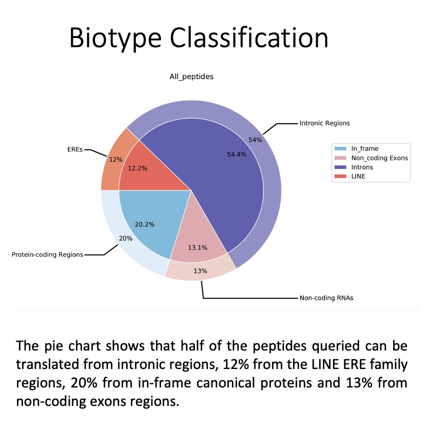
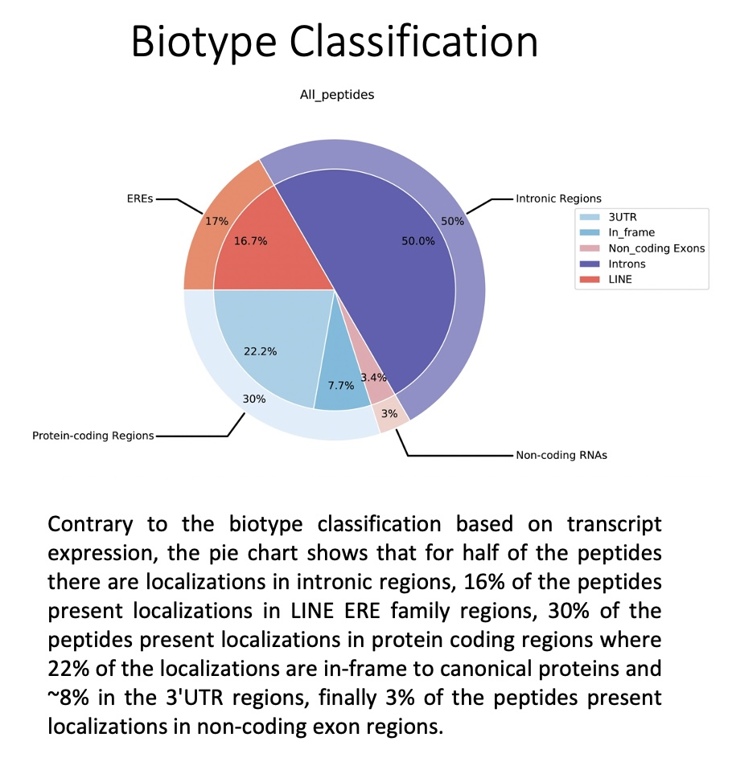

========
Cookbook
========

.. _normal mode example:

normal mode example
===================

**Command line:**

.. code::

	BamQuery.py ./normal_mode_example/Input normal_mode_example 

**1. Input**
------------

Input folder `path_to_input_folder` containing the files : **BAM_directories.tsv** and **peptides.tsv**. 
Please download BAM_directories.tsv and peptides.tsv to access an example of the format of these files.

See:
:download:`BAM_directories.tsv <_static/BAM_directories.tsv>`

See:
:download:`peptides.tsv <_static/peptides.tsv>`

**2. Output**
-------------

BamQuery creates an **output** directory in the same path as the input folder.

This directory contains 4 folders and the main results are organized as follows:

.. code::

	├── alignments
	│   ├── missed_peptides.info
	│   └── normal_mode_info_alignments.xlsx
	├── logs
	│   ├── BamQuery_Res_normal_mode.log
	│   └── Information_BAM_directories.log
	├── plots
	│   ├── biotypes
	│   │   ├── biotype_by_sample_group
	│   │   │   ├── all_peptides
	│   │   │   │   └── normal_mode_All_peptides.pdf
	│   │   │   └── by_peptide_type
	│   │   │       ├── normal_mode_0D5P_Melanoma_ctrl_All_samples.pdf
	│   │   │       └── normal_mode_0D5P_Melanoma_DAC_All_samples.pdf
	│   │   └── genome_and_ERE_annotation
	│   │       ├── all_peptides
	│   │       │   └── normal_mode_All_peptides.pdf
	│   │       └── by_peptide_type
	│   │           ├── normal_mode_0D5P_Melanoma_ctrl.pdf
	│   │           └── normal_mode_0D5P_Melanoma_DAC.pdf
	│   └── heat_maps
	│       └── transcription_evidence_heatmap
	│           ├── average_transcription_expression_heatmap
	│           │   ├── normal_mode_rna_norm_all_tissues.pdf
	│           │   ├── normal_mode_rna_norm_selected_tissues.pdf
	│           │   └── norm_info.csv
	│           └── total_transcription_expression_heatmap
	└── res
	    ├── biotype_classification
	    │   ├── full_info_biotypes
	    │   │   ├── 1_Genomic_and_ERE_Annotations_Full.csv
	    │   │   ├── 2_Genomic_and_ERE_Annotations_Summary_Full.csv
	    │   │   └── 3_Genomic_and_ERE_Anno_by_Region_Full.csv
	    │   └── summary_info_biotypes
	    │       ├── 1_General_Gen_and_ERE_Biotype_Consensus.csv
	    │       ├── 2_Sample_Gen_and_ERE_Biotype_Consensus.csv
	    │       └── 3_Group_Samples_Gen_and_ERE_Biotype_Consensus.csv
	    └── normal_mode_count_norm_info.xlsx

---------------

.. _output_normal_mode_example:

.. _alignments:

**2.1. Alignments**
-------------------

.. code::

	├── alignments
	   ├── missed_peptides.info
	   └── normal_mode_info_alignments.xlsx

**missed_peptides.info file**

This file reports the peptides for which BamQuery has not been able to find locations to evaluate their expression. 

.. _normal mode example info alignments explanation xlsx file:

**normal_mode_example_info_alignments.xlsx file**

.. _COSMIC: https://cancer.sanger.ac.uk/cosmic

This file reports, for each peptide queried, all locations in the genome that are perfect alignments for one or more MAP coding sequences. In addition, it reports the somatic mutations annotated in the `COSMIC`_ database, encountered in the queried peptides.

`Sheet : Perfect Alignments`

For each MAP: position, strand, MCS, reference amino acid, nucleotide differences and SNVs annotated in the dbSNP database are reported. In the case of the latter, it will be reported that the coding sequence has some difference with the reference genome, but has been compensated by one or more annotated SNVs.

.. thumbnail:: _images/normal_mode_example_info_alignments.jpg

`Sheet : COSMIC Information`

Reports whether the SNVs displayed by the peptides have already been annotated as somatic mutations in the COSMIC database.

.. thumbnail:: _images/Cosmic.jpg

Find here the `Additional information`_ description from COSMIC.

.. _Additional information: https://cancer.sanger.ac.uk/cosmic/download

.. _Logs:

-----

**2.2. Logs**
-------------

.. code::

	├── logs
	│   ├── BamQuery_Res_normal_mode.log
	│   └── Information_BAM_directories.log
	      		       

**BamQuery_Res_normal_mode_example.log file**

This file reports all steps that have been performed in the BamQuery search. Refer to this file for the query time of all peptide alignments in the bams, the number of perfect peptide alignments, and the summary of the parameters used in the search.

**Get_Read_Count_BAM_directories.log file**

This file reports for each BAM/CRAM file in the **BAM_directories.tsv** the total number of primary read counts.

-----

**2.3. plots**
--------------

The Plots folder contains the heat map and biotype analysis expression plots for all peptides.
If the --plots parameter is specified, pie charts of the biotype classification are produced. 

.. code::

	├── plots
	│   ├── biotypes
	│   │   ├── biotype_by_sample_group
	│   │   │   ├── all_peptides
	│   │   │   │   └── normal_mode_All_peptides.pdf
	│   │   │   └── by_peptide_type
	│   │   │       ├── normal_mode_0D5P_Melanoma_ctrl_All_samples.pdf
	│   │   │       └── normal_mode_0D5P_Melanoma_DAC_All_samples.pdf
	│   │   └── genome_and_ERE_annotation
	│   │       ├── all_peptides
	│   │       │   └── normal_mode_All_peptides.pdf
	│   │       └── by_peptide_type
	│   │           ├── normal_mode_0D5P_Melanoma_ctrl.pdf
	│   │           └── normal_mode_0D5P_Melanoma_DAC.pdf
	│   └── heat_maps
	│       └── transcription_evidence_heatmap
	│           ├── average_transcription_expression_heatmap
	│           │   ├── normal_mode_rna_norm_all_tissues.pdf
	│           │   ├── normal_mode_rna_norm_selected_tissues.pdf
	│           │   └── norm_info.csv
	│           └── total_transcription_expression_heatmap
	

**biotypes**
-------------------

The `biotype_by_sample_group` folder contains the biotype assignment based on transcription expression, i.e. the biotype is computed based on those locations where there are underlying RNA-seq reads. For more information please refers to :ref:`biotype` and :ref:`biotypes`

This folder contains pie charts organised as follows:

1) `all_peptides`: Pie chart depicting the general assignment of biotypes for all peptides queried based on their transcription in the BAM/CRAM files consulted.  

2) `by_peptide_type`: Pie charts showing the general assignment of biotypes according to each peptide type (specified in the **peptides.tsv** file) based on transcript expression, i.e. biotype is calculated based on the locations where there are underlying RNA-seq reads

The `genome_and_ERE_annotation` folder contains the biotype assignment regardless of transcript expression, i.e. the biotype assignment for each peptide is calculated based on all locations in the genome (expressed or not).

This folder contains pie charts organised as follows:

1) `all_peptides`: Pie chart depicting the general assignment of biotypes for all peptides queried based on all the locations for all the peptides.  

2) `by_peptide_type`: Pie charts showing the general assignment of biotypes according to each peptide type (specified in the **peptides.tsv** file) based on all the locations for all the peptides. 

.. _heat maps folder:

**heat_maps**
-------------------

This folder contains the heat maps representing the transcript expression levels of all peptides queried.

`average_transcription_expression_heatmap` folder: Heat maps depicting transcription expression of all peptides queried as a function of tissue associated with BAM/CRAM files and tissue type.

`_norm_all_tissues.pdf` : heat map depicting the level of transcript expression associated with all tissue types.

.. thumbnail:: _images/average_transcription_expression_heatmap.jpg

`_norm_selected_tissues.pdf` : heat map depicting the expression level of transcripts associated with selected tissues (short list of tissues).

.. thumbnail:: _images/average_transcription_expression_heatmap_selected.jpg

`norm_info.csv`: reports, for each peptide consulted, the mean and median rphm values according to the tissues associated with the BAM/CRAM files.

.. thumbnail:: _images/norm_info_.jpg

`total_transcription_expression_heatmap` folder: Heat map depicting the transcript expression of all peptides queried as a function of each BAM/CRAM file.

.. warning::
	1. Heat maps are produced for searches with less than 400 peptides.
	2. Heat map in total_transcription_expression_heatmap is produced only if the number of BAM/CRAM files queried are less than 100 tissues.

-----------

**2.4. res**
------------

.. code::

	res
	    ├── biotype_classification
	    │   ├── full_info_biotypes
	    │   │   ├── 1_Genomic_and_ERE_Annotations_Full.csv
	    │   │   ├── 2_Genomic_and_ERE_Annotations_Summary_Full.csv
	    │   │   └── 3_Genomic_and_ERE_Anno_by_Region_Full.csv
	    │   └── summary_info_biotypes
	    │       ├── 1_General_Gen_and_ERE_Biotype_Consensus.csv
	    │       ├── 2_Sample_Gen_and_ERE_Biotype_Consensus.csv
	    │       └── 3_Group_Samples_Gen_and_ERE_Biotype_Consensus.csv
	    └── normal_mode_count_norm_info.xlsx

**biotype_classification**
---------------------------------

.. _Ensembl: https://m.ensembl.org/info/genome/genebuild/biotypes.html

.. note::
	The biotype annotation is derived from the intersection of the peptide positions with the genomic and ERE annotations. For more information see :ref:`biotypes`.

	From the genomic annotations, 3 levels of biotypes are reported : gene level, transcript level and genomic position level. 

	At the gene level, the biotype assigned to the location is given by the biotype type of the gene in the genomic annotations of `Ensembl`_, for instance:
		* protein_coding,
		* lincRNA,
		* intergenic...

	At the transcript level, the biotype assigned to the location is given by the biotype type of the transcript in the genomic annotations of `Ensembl`_, for instance:
		* protein_coding,
		* processed_transcript, TEC, etc...

	At the genomic position level, the biotype assigned to the location is given by the overlapping region between the peptide and the transcript annotated in `Ensembl`_, for instance:
		* In_frame,
		* junctions,
		* introns,
		* 3'UTR, etc...

	As for the ERE annotations, 3 levels of biotypes as reported:  name, class and family of the ERE instersecting a location. 

	.. thumbnail:: _images/genomic_ere_annotation.png
      		         

**full_info_biotypes**

.. _Genomic_and_ERE_Annotations_Full:

`1_Genomic_and_ERE_Annotations_Full.csv`: 
Reports for each peptide, each MCS at each location and for each BAM/CRAM included in **BAM_directories.tsv**:
	(a) gene, (b) transcript, (c) genomic location, (d) ERE name, (e) ERE class, and (f) ERE family biotypes.
	g) also, the total count of RNA-seq reads bearing the given MCS at the given location.

.. thumbnail:: _images/genomic_and_ERE_Annotations_Full.jpg

.. _Genomic_and_ERE_Annotations_Summary_Full:

`2_Genomic_and_ERE_Annotations_Summary_Full.csv`: 
Reports for each peptide, each location and for each BAM/CRAM included in **BAM_directories.tsv**:
	(a) gene, (b) transcript, (c) genomic location, (d) ERE name, (e) ERE class, and (f) ERE family biotypes.
	g)also, the total count of RNA-seq reads bearing MCS at the given location.

.. thumbnail:: _images/genomic_and_ERE_Annotations_Summary_Full.jpg

.. _Genomic_and_ERE_Anno_by_Region_Full:

`3_Genomic_and_ERE_Anno_by_Region_Full.csv`: 
Reports for each peptide, each location and for each BAM/CRAM included in **BAM_directories.tsv**:
	(a) gene, (b) transcript, (c) genomic location, (d) ERE name, (e) ERE class, and (f) ERE family biotypes.
	g)also, the total count of RNA-seq reads bearing MCS at the given location.

.. thumbnail:: _images/genomic_and_ERE_Anno_by_Region_Full.jpg

-----

**summary_info_biotypes**

.. _General_Gen_and_ERE_Biotype_Consensus:

`1_General_Gen_and_ERE_Biotype_Consensus.csv`: 
It reports for each peptide the consensus biotype based on all locations in the genome, so the percentage is computed from the frequencies of occurrence of the biotypes. For example, 3 locations were collected for a given peptide.
Location 1 intersects one transcript of a canonical protein (in_frame), location 2 intersects two transcripts of a different canonical protein (first transcript: in_frame, second transcript: 3'UTR), location 3 intersects the intronic region of a different transcript. The final biotype corresponds to: In_frame : 50%, 3'UTR : 25%, Introns : 25%. i.e, no takes into consideration the transcription expression).

.. thumbnail:: _images/general_Gen_and_ERE_Biotype_Consensus.jpg

.. _Sample_Gen_and_ERE_Biotype_Consensus:

`2_Sample_Gen_and_ERE_Biotype_Consensus.csv`: 
It reports for each peptide the consensus biotype based on all expressed locations in the genome. Hence the percentage is computed from the count of RNA-seq reads attributed to each biotype according to the coefficients estimated using the EM algorithm as a function of the total reads for the given peptide (only expressed locations are taken into account to calculate the percentage) in all the samples.

.. thumbnail:: _images/sample_Gen_and_ERE_Biotype_Consensus.jpg

.. _Group_Samples_Gen_and_ERE_Biotype_Consensus:

`3_Group_Samples_Gen_and_ERE_Biotype_Consensus.csv`: 
It reports for each peptide the consensus biotype based on all expressed locations in the genome. Hence the percentage is computed from the count of RNA-seq reads attributed to each biotype according to the coefficients estimated using the EM algorithm as a function of the total reads for the given peptide in every group of samples as well as for all the samples (only expressed locations are taken into account to calculate the percentage) for each group of samples and all the samples.

.. thumbnail:: _images/group_Samples_Gen_and_ERE_Biotype_Consensus.jpg

-----

.. _normal_mode_count_norm_info:

**normal_mode_count_norm_info.xlsx**

`Sheet : Alignments Read count RNA-seq`

This sheet reports for each peptide queried, all positions in the genome that are perfect alignments for one or more coding sequences of a peptide are reported. For each position, the strand, coding sequence and read count for each BAM/CRAM file are reported.

.. thumbnail:: _images/alignments_Read_count_RNA_seq.jpg

.. _read count RNA seq by peptide:

`Sheet : Read count RNA-seq by peptide`

This sheet reports for each peptide queried, the total reads for each BAM/CRAM file considering all positions. 

.. thumbnail:: _images/read_count_RNA_seq_by_peptide.jpg

.. _log10 RPHM RNA seq by peptide:

`Sheet : log10(RPHM) RNA-seq by peptide`

This sheet reports for each peptide queried, the :math:`rphm` `(read per hundred million)` for each BAM/CRAM file considering all expressed positions. The :math:`rphm = (read\_overlap * 10^8)/total\_primary\_reads` with `total_primary_reads` representing the total number of reads sequenced in a given RNA-Seq experiment. These values are transformed into logarithm :math:`log_{10}(rphm + 1)`.

This information is used to plot the rphm heat map. See `heat maps folder`_

.. thumbnail:: _images/log10RPHM.jpg

---------------

.. _light_mode_example:

light mode example
===================

The light mode of BamQuery was designed to perform a quick search for peptide expression in the specified BAM/CRAM files. In this mode, BamQuery only reports peptide counts and normalization, so no biotyping analysis is performed for peptides (no graph (heat map, pie chart) is produced).

**Command line:**

.. code::

	BamQuery.py ./normal_mode_example/Input normal_mode_example --light

As for normal mode, the input folder `path_to_input_folder` must containt the files : **BAM_directories.tsv** and **peptides.tsv**.

**2. Output**
-------------

BamQuery creates an **output** directory in the same path as the input folder.

This directory contains 3 folders and the main results are organized as follows:

.. code::

	├── alignments
	│   ├── light_mode_info_alignments.xlsx
	│   └── missed_peptides.info
	├── logs
	│   ├── BamQuery_Res_light_mode.log
	│   └── Information_BAM_directories.log
	└── res_light
	    └── light_mode_count_norm_info.xlsx

The output files in `light mode` are similar to those in `normal mode`, see `output_normal_mode_example`_ for detailed information about the output files.

.. note::
		After running BamQuery in `--light` mode, it is possible to run BamQuery in normal mode (to obtain biotype classification and other output files) for a subset of peptides (peptides of interest `PoIs`). To do this, first run BamQuery in light mode by adding the `--dev` parameter. Once BamQuery light has finished, modify the **peptides.tsv** file, to remove the peptides you are no longer interested in. Finally, run the BamQuery search in `normal mode` by removing the `--light` option from the command line. By doing this, BamQuery takes the information already obtained for the expression in light mode and produces heatmap plots and does the biotype analysis only for the `PoIs`.

   .. warning::
   		WARNING: do not modify the **BAM_directories.tsv**, otherwise you will not have consistent information.

---------------

.. _single_cell_example:

single cell example
===================

.. code::
	.
	├── alignments
	│   ├── missed_peptides.info
	│   └── sc_example_info_alignments.xlsx
	├── logs
	│   ├── BamQuery_Res_sc_example.log
	│   └── Information_BAM_directories.log
	└── res
	    ├── sc_example_rna_sc_count_All_alignments.csv
	    └── sc_example_rna_sc_count.csv

