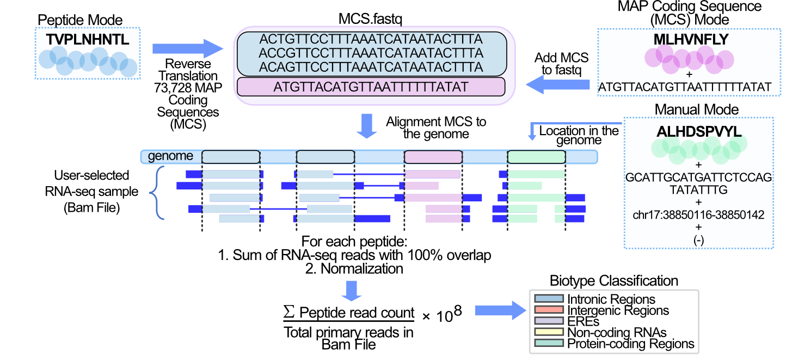

========
Methods
========

.. _bamquery_steps:

BamQuery Steps
==============

BamQuery works on Bam files in five steps. 

1. Reverse translation of MHC-I-associated peptides (MAPs). 
-----------------------------------------------------------

Each MAP in `Peptide mode`_ is reverse-translated. MAP coding sequences (MCS) are compiled into a **<query_name>.fastq** file along with any MCS from MAPs in the `MAP coding sequence mode`_ .

.. _collect locations:

2. Collect the locations of the MAP Coding Sequences (MCS) in the genome. 
--------------------------------------------------------------------------

The MCS in the **<query_name>.fastq** file are mapped with the STAR aligner to the reference genome version (GENCODE version 26, 33 or 38 ) selected.

**The genomic locations of the MCS** are collected from the alignments in STAR's Aligned.out.sam file.
A perfect alignment is defined as one in which the MCS exactly matches the reference genome sequence. 
A perfect alignment is also one in which the MCS does not exactly match the reference, but the mismatches are supported by SNPs included in the user-selected dbSNP (149,151,155 dbSNP releases). 

3. Count RNA-seq reads that exactly bear the MCS. 
--------------------------------------------------

Each BAM/CRAM file is queried at all genomic locations collected for each MAP. 
From the BAM/CRAM file, primary alignments of the RNA-seq reads at each location are selected using the **pysam** library in python. 
Each read is examined to select only those readings that contain the MCS reported at the location.
Finally, BamQuery sums all RNA-seq reads (primary alignment) at all genomic locations that exactly match the MCS of a MAP.

.. warning::
	Total RNA-seq reads count changes according to the :ref:`strandedness` parameter.

4. Normalization. 
-----------------

The :math:`tr_{MAP}` (total reads MAP) is transformed into a number of reads detected per :math:`10^{8}` reads sequenced (𝑟𝑝ℎ𝑚) 
following the formula : :eq:`rphm`. |br|
:math:`R_{t}` represents the total number of reads sequenced in a given RNA-Seq dataset. |br|
These final values are log-transformed :math:`log_{10} (𝑟𝑝ℎ𝑚 + 1)` to allow comparison and averaging between samples, thus removing the bias of large values.

.. math::
	𝑟𝑝ℎ𝑚 = \frac{tr_{MAP} } {R_{t} } * 10^{8} 
	:label: rphm

.. _biotype:

5. Biotype classification. 
--------------------------

Each MAP is classified according to all its MCS genomic locations and their transcription level. 
Biotype screening is performed using the GENCODE annotations according to the reference genome selected by the user and the RepeatMasker annotations 
to account for human ERE sequences. 
All MCS genomic locations are included in a BED file for intersect with such annotations using BEDtools.
To account for locations overlapping with several transcripts, reads were scaled according to the read distribution 
coefficient for each biotype estimated with the expectation maximization (EM) statistical model. |br|
For more information, see :ref:`biotypes`.

As a result, BamQuery attributes a comprehensive RNA expression to any MAP of interest in any user-selected RNA-seq dataset. 

---------------

Input Modes
===================

BamQuery is designed to analyze MAPs ranging in length from 8 to 11 amino acids (aa). 
As peptide input, BamQuery supports three different formats that can be pulled into a single input file (See `peptides tsv`_). 

.. _Peptide mode:

**A) Peptide mode:** only the amino acid sequence of the MAP is provided, hence BamQuery performs a comprehensive search for its RNA-seq expression. 

.. _MAP coding sequence mode:

**B) MAP coding sequence mode:** the amino acid sequence of the MAP is provided, hence BamQuery performs the search for the expression of the given MCS. 

**C) Manual mode:** the amino acid sequence of the MAP is provided followed by a MCS, the corresponding location in the genome of the given MCS, the strand (+ forward or - reverse), whereby BamQuery performs the expression search at the given location for the given MCS.

-----------

.. _format input files:

Format Input Files
===================

BamQuery requires two input file paths to search for RNA expression:

**A) BAM_directories:** list of Bam files in which the search is performed
**B) peptides.tsv:** list of peptides to be searched

**A) BAM_directories.tsv**
--------------------------

	This file should look like follows:

	.. image:: _images/BAM_directories.png
	   :alt: Format BAM_directories.tsv
	   :align: left

	BamQuery collects all BAM/CRAM files in each path included in the list. For instance from the path /home/gtex/, BamQuery collects all the bam files for every tissue in gtex.

	Note that:

	1. The first column is the name of the BAM/CRAM file or group of files to be queried. This name should describe the type of BAM/CRAM file(s).
	2. The second column should be the path to the BAM/CRAM file(s).
	3. The first and second columns are separated by a tab space. 
	4. Do not use any headers in your tsv file.

.. _peptides tsv:

**B) peptides.tsv**
-------------------

	This file should look like follows:

	.. image:: _images/peptides_file_format.png
	   :alt: Format peptides.tsv
	   :align: left

	Note that all modes can be merged into a single peptides.tsv, however, you must follow the format assigned for each mode.

	
	.. warning::
		If a peptide has several peptide types, separate each peptide type with ", or ;". For example: `lymphoma,colon`, would mean that the peptide was identified in lymphoma and colon cells.

	**Peptides in peptide mode:** |br|
	Two columns separated by a tab space:
		* amino acid sequence of the peptide. |br|
		* type of peptide to identify it. This name, for example, may refer to the condition or sample in which the peptide was identified. 
		
	**Peptides in coding sequence mode:** |br|
	Three columns separated by a tab space: 
		* amino acid sequence of the peptide. |br|
		* nucleotide sequence of the peptide. |br|
		* type of peptide to identify it. 
		
	**Peptides in manual mode:** |br|
	Five columns separated by a tab space:
		* amino acid sequence of the peptide. |br|
		* nucleotide sequence of the peptide. |br|
		* position of the peptide. |br|
		* strand backward (-) or forward (+) for the location of the peptide in the genome. |br|
		* type of peptide to identify it. 

	.. warning::
		The peptide location must follow the format: chrX:start-end|start-end. Note: chrX (for any chromosome), start = start location, end = end location. Only use "|" to specify if the peptide is spliced.
		The strand must be specified as (-) backward or (+) forward.
		

.. |br| raw:: html

       